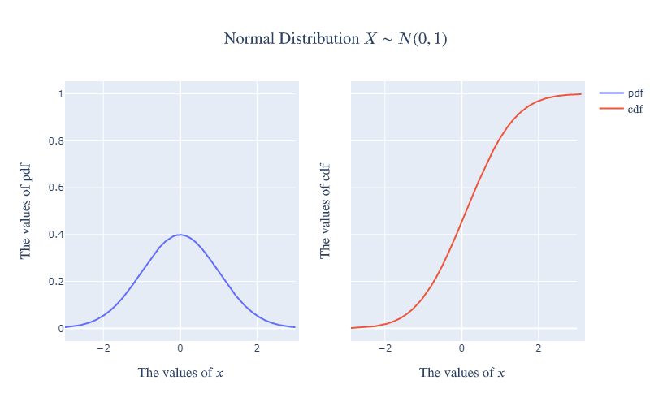
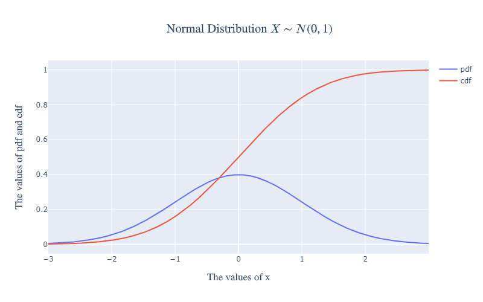
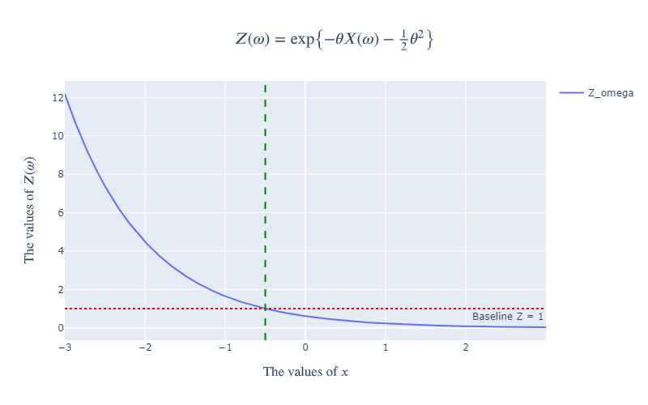
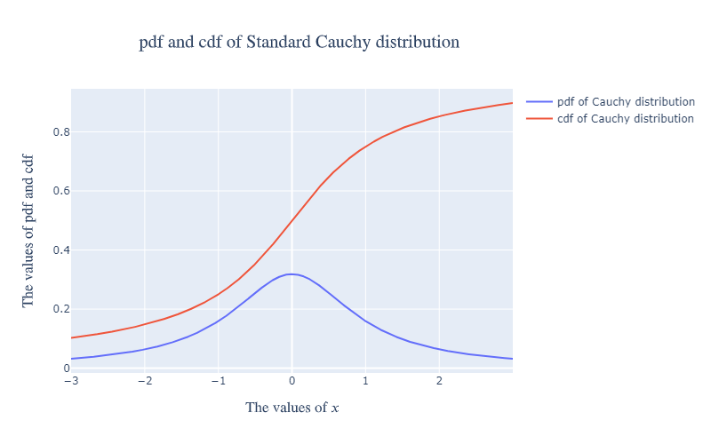
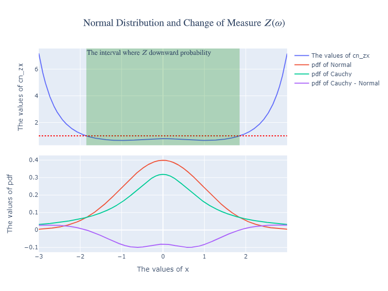
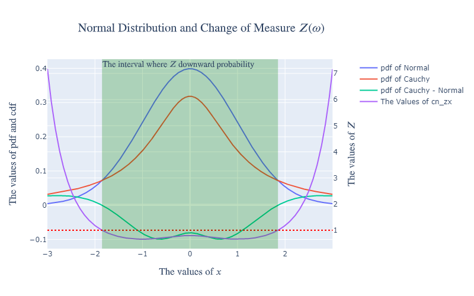
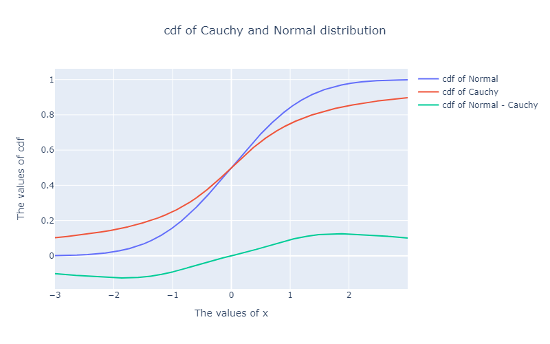

## 1 Introduction

### 1.1 Chapter 1 section 6 assert the following conclusions:

We pick up the thread of Section 3.1 of Volume I, in which we used a positive random variable $Z$ to change probability measures on a space $\Omega$. We need to do this when we change from the actual probability measure $\mathbb{P}$ to the risk-neutral probability measure $\widetilde{\mathbb{P}}$ in models of financial markets. When $\Omega$ is uncountably infinite and $\mathbb{P}(\omega) = \widetilde{\mathbb{P}}(\omega) = 0$ for every $\omega \subseteq \Omega$, it no longer makes sense to write (3.1.1) of Chapter 3 of Volume I,
$$
Z(\omega)=\frac{\widetilde{\mathbb{P}}(\omega)}{\mathbb{P}(\omega)} \tag{1.6.1}
$$

because division by zero is undefined. We could rewrite this equation as
$$
Z(\omega) \mathbb{P}(\omega) = \widetilde{\mathbb{P}}(\omega) \tag{1.6.2}
$$

and now we have a meaningful equation, with both sides equal to zero, but the
equation tells us nothing about the relationship among $\mathbb{P}$, $\widetilde{\mathbb{P}}$, and $Z$. Because $\mathbb{P}(\omega) = \widetilde{\mathbb{P}}(\omega) = 0$, the value os $Z(\omega)$ could be anything and (1.6.2) would still hold.

However, (1.6.2) does capture the spirit of what we would like to accomplish. To change from $\mathbb{P}$ to $\widetilde{\mathbb{P}}$, **we need to reassign probabilities in $\Omega$ using $Z$ to tell us where in $\Omega$ we should revise the probability upward (where $Z > 1$) and where we should revise the probability downward (where $Z < 1$).** However, we should do this set-by-set, rather than $\omega$-by-$\omega$. The process is described by the following theorem.

**Theorem 1.6.1.** Let $(\Omega, \mathcal{F}, \mathbb{P})$ be a probability space and let $Z$ be an almost surely nonnegative random variable with $\mathbb{E}Z = 1$. For $ A \subseteq \mathcal{F}$, define
$$
\widetilde{\mathbb{P}}(A)=\int_{A} Z(\omega) d \mathbb{P}(\omega) \tag{1.6.3}
$$

Then $\widetilde{\mathbb{P}}$ is a probability measure. Furthermore, if $X$ is a nonnegative random variable, then
$$
\widetilde{\mathbb{E}} X=\mathbb{E}[X Z] \tag{1.6.4}
$$

If $Z$ is almost surely strictly positive, we also have
$$
\mathbb{E} Y=\widetilde{\mathbb{E}}\left[\frac{Y}{Z}\right] \tag{1.6.5}
$$

for every nonnegative random variable $Y$.

The $\widetilde{\mathbb{E}}$ appearing in (1.6.4) is expectation under the probability measure $\widetilde{\mathbb{P}}$ (i.e., $\widetilde{\mathbb{E}}X = \int_{\Omega} X(\omega) d \mathbb{P}(\omega)$).

**Definition 1.6.3.** Let $\Omega$ be a nonemyty set and $\mathcal{F}$ a a-algebra of subsets of $\Omega$. Two probability measures $\mathbb{P}$ and $\widetilde{\mathbb{P}}$ on $(\Omega, \mathcal{F})$ are said to be equivalent if they agree which sets in $\Omega$ have probability zero.

**Definition 1.6.5** Let $(\Omega, \mathcal{F}, \mathbb{P})$ be a probability space, let $\widetilde{\mathbb{P}}$ be another probability measure on $(\Omega, \mathcal{F})$ that is equivalent to $\mathbb{P}$, and let $Z$ be an almost surely positive random variable that relates $\mathbb{P}$ and $\widetilde{\mathbb{P}}$ via {1.6.3}. Then $Z$ is called the Radon-Nikodym derivative of $\widetilde{\mathbb{P}}$ with respect to $\mathbb{P}$, and we write
$$
Z=\frac{d \widetilde{\mathbb{P}}}{d \mathbb{P}}
$$

**Theorem 1.6.7 (Radon-Nikodym).** Let $\mathbb{P}$ and $\widetilde{\mathbb{P}}$ be equivalent probability measures defined on $(\Omega, \mathcal{F})$. Then there exists an almost surely positive
random variable $Z$ such that $\mathbb{E}Z = 1$ and
$$
\widetilde{\mathbb{P}}(A)=\int_{A} Z(\omega) d \mathbb{P}(\omega) \text { for every } A \in \mathcal{F}
$$

### 1.2 正态分布简介

[正态分布](https://zh.wikipedia.org/zh-cn/%E6%AD%A3%E6%80%81%E5%88%86%E5%B8%83)的[概率密度函数](https://zh.wikipedia.org/zh-cn/%E6%A9%9F%E7%8E%87%E5%AF%86%E5%BA%A6%E5%87%BD%E6%95%B8)是均值为$\mu$  方差为$\sigma ^{2}$(或标准差$\sigma$)是高斯函数的一个实例：
$$
f(x ; \mu, \sigma)=\frac{1}{\sigma \sqrt{2 \pi}} \exp \left(-\frac{(x-\mu)^{2}}{2 \sigma^{2}}\right)
$$

[累积分布函数](https://zh.wikipedia.org/zh-cn/%E7%B4%AF%E7%A7%AF%E5%88%86%E5%B8%83%E5%87%BD%E6%95%B0)是指随机变量$X$小于或等于$x$的概率，用概率密度函数表示为
$$
F(x ; \mu, \sigma)=\frac{1}{\sigma \sqrt{2 \pi}} \int_{-\infty}^{x} \exp \left(-\frac{(t-\mu)^{2}}{2 \sigma^{2}}\right) d t
$$

如果一个随机变量$X$服从这个分布，我们写作$X \sim N(\mu ,\sigma ^{2})$. 如果$\mu = 0$并且$\sigma = 1$，这个分布被称为**标准正态分布**，这个分布能够简化为
$$
f(x)=\frac{1}{\sqrt{2 \pi}} \exp \left(-\frac{x^{2}}{2}\right)
$$

$$
F(x)=\int_{-\infty}^{x} f(t) d t = \frac{1}{\sqrt{2 \pi}} \int_{-\infty}^{x} \exp \left(-\frac{t^{2}}{2}\right) d t
$$

### 1.3 正态随机变量的测度变换

令$X$为标准正态随机变量,即
$$
\mu_{X}(B)=\mathbb{P}\{X \in B\}=\int_{B} \varphi(x) d x \text { for every Borel subset } B \text { of } \mathbb{R} \tag{1.6.7}
$$

其中概率密度函数(Probability Density Function)如下
$$
\varphi(x)=\frac{1}{\sqrt{2 \pi}} e^{-\frac{x^{2}}{2}}
$$

我们取$B = \left(-\infty, b \right]$, 则得到如下熟悉的累积分布函数(Cumulative Distribution Function)
$$
\mathbb{P}\{X \leq b\}=\int_{-\infty}^{b} \varphi(x) d x \text { for every } b \in \mathbb{R} \tag{1.6.8}
$$

同时定义如下随机变量$Z(\omega)$
$$
Z(\omega)=\exp \left\{-\theta X(\omega)-\frac{1}{2} \theta^{2}\right\} \text { for all } \omega \in \Omega
$$

我们有
$$
\begin{aligned}
\mathbb{E} Z &=\int_{-\infty}^{\infty} \exp \left\{-\theta x-\frac{1}{2} \theta^{2}\right\} \varphi(x) d x \\
&=\frac{1}{\sqrt{2 \pi}} \int_{-\infty}^{\infty} \exp \left\{-\frac{1}{2}\left(x^{2}+2 \theta x+\theta^{2}\right)\right\} d x \\
&=\frac{1}{\sqrt{2 \pi}} \int_{-\infty}^{\infty} \exp \left\{-\frac{1}{2}(x+\theta)^{2}\right\} d x \\
&=\frac{1}{\sqrt{2 \pi}} \int_{-\infty}^{\infty} \exp \left\{-\frac{1}{2} y^{2}\right\} d y
\end{aligned}
$$

及
$$
\begin{aligned}
\widetilde{\mathbb{P}}\{Y \leq b\} &=\int_{\{\omega ; Y(\omega) \leq b\}} Z(\omega) d \mathbb{P}(\omega) \\
&=\int_{\Omega} \mathbb{I}_{\{Y(\omega) \leq b\}} Z(\omega) d \mathbb{P}(\omega) \\
&=\int_{\Omega} \mathbb{I}_{\{X(\omega) \leq b-\theta\}} \exp \left\{-\theta X(\omega)-\frac{1}{2} \theta^{2}\right\} d \mathbb{P}(\omega) \\
&=\int_{-\infty}^{\infty} \mathbb{I}_{\{x \leq b-\theta\}} e^{-\theta x-\frac{1}{2} \theta^{2}} \varphi(x) d x \\
&=\frac{1}{\sqrt{2 \pi}} \int_{-\infty}^{b-\theta} e^{-\theta x-\frac{1}{2} \theta^{2}} e^{-\frac{x^{2}}{2}} d x \\
&=\frac{1}{\sqrt{2 \pi}} \int_{-\infty}^{b-\theta} e^{-\frac{1}{2}(x+\theta)^{2}} d x \\
&=\frac{1}{\sqrt{2 \pi}} \int_{-\infty}^{b} e^{-\frac{1}{2} y^{2}} d y
\end{aligned}
$$

即$\mathbb{E} Z =\frac{1}{\sqrt{2 \pi}} \int_{-\infty}^{\infty} \exp \left\{-\frac{1}{2} y^{2}\right\} d y = 1$满足Radon-Nikodym定理(1.6.7)且$\widetilde{\mathbb{P}}\{Y \leq b\}=\frac{1}{\sqrt{2 \pi}} \int_{-\infty}^{b} e^{-\frac{1}{2} y^{2}} d y$, 因此随机变量$Y$在概率测度$\widetilde{\mathbb{P}}$下是标准正态随机变量.

##  2 In Python's Perspective

### 2.1 准备工作

```python
import numpy as np
import pandas as pd
from scipy import stats

import cufflinks as cf
from plotly.offline import iplot, init_notebook_mode

# set up configuration (run it once)
cf.set_config_file(world_readable=True, theme='pearl',offline=True)
init_notebook_mode()

from plotly.subplots import make_subplots # 画图工具
import plotly.graph_objects as go
```

要用到的函数说明：

$\text{返回} X \sim N (\mu, \sigma) \text{的概率密度函数}$(pdf) $f(x, \mu, \sigma)$

```python
stats.norm.pdf(x, mu, sigma)
```

$\text{返回} X \sim N (\mu, \sigma) \text{的概率分布函数}$(cdf) $F(x, \mu, \sigma)$
```python
stats.norm.cdf(x, mu, sigma)
```

$\text{返回} X \sim N (\mu, \sigma) \text{置信度为}\alpha\text{的上分位数} Z(\alpha , \mu, \sigma)$
```python
stats.norm.isf(alpha, mu, sigma)
```

创建标准正态分布及其pdf和cdf

```python
dx = 0.001
mu = 0
sigma = 1
sigma_N = 3 * sigma
x = np.arange(-sigma_N, sigma_N, dx) # 由于标准正态分布的值在3σ域外几乎可以忽略不计，因此选定定义域为[-3σ, 3σ)

y_pdf = stats.norm.pdf(x, 0, 1) # 标准正态分布概率密度函数(Probability Density Function)
y_cdf = stats.norm.cdf(x, 0, 1) # 标准正态分布累积分布函数(Cumulative Distribution Function)
```

### 2.2 绘制标准正态分布的pdf和cdf图像

```python
fig = make_subplots(rows=1, cols=2, shared_yaxes=True, horizontal_spacing=0.1)

fig.add_trace(go.Scatter(x=x, y=y_pdf, name='pdf'), row=1, col=1)
# 非LaTeX显示图例 不建议使用LaTeX显示图例，否则如果图例较长的话，容易与图像重叠，造成图像不美观，尤其是下面设置双Y轴时
fig.add_trace(go.Scatter(x=x, y=y_cdf, name=r'$\text{cdf}$'), row=1, col=2) # LaTeX显示图例

fig.update_xaxes(title_text=r'$\text{The values of }x$', row=1, col=1)
fig.update_xaxes(title_text=r'$\text{The values of }x$', row=1, col=2)
fig.update_yaxes(title_text=r'$\text{The values of pdf}$', row=1, col=1)
fig.update_yaxes(title_text=r'$\text{The values of cdf}$', row=1, col=2)

fig.update_layout(height=500, width=800,
                  title_text=r"$\text{Normal Distribution } X \sim N(0, 1)$", title_x=0.5) 
# 显示LaTeX标题

fig.show()
```


将图像绘制在一张图上

```python
fig = go.Figure()

fig.add_trace(go.Scatter(x=x, y=y_pdf, mode='lines', name='pdf'))
fig.add_trace(go.Scatter(x=x, y=y_cdf, mode='lines', name='cdf'))
fig.update_layout(height=500, width=800, title_text=r"$\text{Normal Distribution } X \sim N(0, 1)$", title_x=0.5,
                 xaxis_title = r'$\text{The values of x}$',
                 yaxis_title = r'$\text{The values of pdf and cdf}$')

fig.show()
```



### 2.3 可视化将概率测度$\mathbb{P}$变换成$\widetilde{\mathbb{P}}$ 的$Z(\omega)$

$$
d \widetilde{\mathbb{P}} = Z(x) {d \mathbb{P}} = Z(x) \varphi(x) d x = Z(x) \frac{1}{\sqrt{2 \pi}} e^{-\frac{x^{2}}{2}} d x
$$

$$
Z(\omega)=\exp \left\{-\theta X(\omega)-\frac{1}{2} \theta^{2}\right\} \text { for all } \omega \in \Omega
$$

生成$\theta = 1 \text{的} Z (\omega)$

```python
theta = 1
Z_omega = np.exp(-theta * x - 0.5 * theta ** 2)
```

绘制$Z (\omega)$图像
```python
# Initialize figure with subplots
fig = go.Figure()

# Add traces
fig.add_trace(go.Scatter(x=x, y=Z_omega, mode='lines', name='Z_omega'))
fig.add_hline(y=1, name = 'Z_omega = 1', line_color = "red", line_dash="dot", line_width=2,
              annotation_text="Baseline Z = 1", 
              annotation_position="bottom right") #添加水平线Z_omega = 1，用于直观判断Z对原始概率增大和减小的分界点
fig.add_vline(x=-0.5, line_width=2, line_dash="dash", line_color="green")
#添加垂直线x = -0.5，即Z对原始概率改变的分界点为x=-0.5
#fig.add_trace(go.Scatter(x=x, y=base, mode='lines', name='Baseline Z = 1'))

# Update xaxis properties
fig.update_xaxes(title_text=r'$\text{The values of }x$')

# Update yaxis properties
fig.update_yaxes(title_text=r'$\text{The values of }Z(\omega)$')

# Update layout info
fig.layout.xaxis.automargin: True
fig.update_layout(height=500, width=800, showlegend=True,
                  title_text=r"$Z(\omega)=\exp \left\{-\theta X(\omega)-\frac{1}{2} \theta^{2}\right\}$",
                  title_x=0.5)

fig.show()
```



生成经过$Z (\omega)$变换后的新概率分布

```python
Z_x_pdf = stats.norm.pdf(x, -1, 1)
Z_x_cdf = stats.norm.cdf(x, -1, 1)
```

绘制变换前后的概率分布图象

```python
# Create figure with secondary y-axis
fig = make_subplots(specs=[[{"secondary_y": True}]])

fig.add_trace(go.Scatter(x=x, y=y_pdf, mode='lines', name='pdf of normal distribution'), secondary_y=False)
fig.add_trace(go.Scatter(x=x, y=Z_x_pdf, mode='lines', name='pdf of Z_x'), secondary_y=False)

fig.add_trace(go.Scatter(x=x, y=y_cdf, mode='lines', name='cdf of normal distribution'), secondary_y=False)
fig.add_trace(go.Scatter(x=x, y=Z_x_cdf, mode='lines', name='cdf of Z_x'), secondary_y=False)

fig.add_trace(go.Scatter(x=x, y=Z_omega, mode='lines', name="The values of Z"), secondary_y=True)
fig.add_hline(y=1, name = 'Z_omega = 1', line_color = "red", line_dash="dot", line_width=2, secondary_y=True)
# annotation_text="Baseline Z = 1"无法在secondary y-axis显示
# annotation_position="bottom right"无法在secondary y-axis显示
fig.add_vline(x=-0.5, line_width=2, line_dash="dash", line_color="green")

fig.update_xaxes(title_text = r'$\text{The values of }x$')
fig.update_yaxes(title_text = r'$\text{The values of pdf and cdf}$', secondary_y=False)
fig.update_yaxes(title_text = r'$\text{The values of }Z$', secondary_y=True)

    
fig.update_layout(height=500, width=800, title_text=r"$\text{Normal Distribution and Change of Measure } Z(\omega) $",
                  title_x=0.4)

fig.show()
```


### 2.4 正态分布与柯西分布的测度变换

[柯西分布](https://zh.wikipedia.org/wiki/%E6%9F%AF%E8%A5%BF%E5%88%86%E5%B8%83)也叫作柯西-洛伦兹分布，它是以[奥古斯丁·路易·柯西](https://zh.wikipedia.org/wiki/%E5%A5%A7%E5%8F%A4%E6%96%AF%E4%B8%81%C2%B7%E8%B7%AF%E6%98%93%C2%B7%E6%9F%AF%E8%A5%BF)与[亨德里克·洛伦兹](https://zh.wikipedia.org/wiki/%E4%BA%A8%E5%BE%B7%E9%87%8C%E5%85%8B%C2%B7%E6%B4%9B%E4%BC%A6%E5%85%B9)名字命名的连续概率分布，其概率密度函数为

$$
\begin{array}{l}
c\left(x ; x_{0}, \gamma\right)=\frac{1}{\pi \gamma\left[1+\left(\frac{x-x_{0}}{\gamma}\right)^{2}\right]} \\
=\frac{1}{\pi}\left[\frac{\gamma}{\left(x-x_{0}\right)^{2}+\gamma^{2}}\right]
\end{array}
$$

其中$x_0$是定义分布峰值位置的位置参数，$\gamma$是最大值一半处的一半宽度的尺度参数。

$x_0 = 0$且$γ = 1$的特例称为**标准柯西分布**，其概率密度函数为

$$
c(x ; 0,1)=\frac{1}{\pi\left(1+x^{2}\right)}
$$

回顾以下**正态分布**$X$ ~ $N(\mu ,\sigma ^{2})$概率密度函数

$$
g(x ; \mu, \sigma)=\frac{1}{\sigma \sqrt{2 \pi}} \exp \left(-\frac{(x-\mu)^{2}}{2 \sigma^{2}}\right)
$$

如果$\mu = 0$并且$\sigma = 1$，则这个分布简化为
$$
g(x)=\frac{1}{\sqrt{2 \pi}} \exp \left(-\frac{x^{2}}{2}\right)
$$

令

$$
Z(x) = {\sqrt{2 \pi}} \exp \left(\frac{x^{2}}{2}\right) \frac{1}{\pi\left(1+x^{2}\right)}
$$

则

$$
c(x ; 0,1)= Z(x) \ast g(x)
$$

创建标准柯西分布

```python
x_0 = 0
gamma = 1

cauchy_pdf = stats.cauchy.pdf(x, loc=0, scale=1)
cauchy_cdf = stats.cauchy.cdf(x, loc=0, scale=1)
cn_zx = 1 / y_pdf * cauchy_pdf
```

绘制标准柯西分布pdf和cdf

```python
fig = go.Figure()

fig.add_trace(go.Scatter(x=x, y=cauchy_pdf, mode='lines', name='pdf of Cauchy distribution'))
fig.add_trace(go.Scatter(x=x, y=cauchy_cdf, mode='lines', name='cdf of Cauchy distribution'))

fig.update_layout(height=500, width=800, title_text=r"$\text{pdf and cdf of Standard Cauchy distribution}$",
                  title_x=0.4,
                  xaxis_title = r'$\text{The values of }x$',
                  yaxis_title = r'$\text{The values of pdf and cdf}$')

fig.show()
```



计算$Z (\omega) = 1$的临界点

```python
critical = max(np.where(cn_zx<1.00001)).max() # 注意Z(ω)为对称函数，求得一侧临界点即可反推另一侧临界点
left = -sigma_N + (len(x)-critical)*dx # Z > 1的左边界
right = -sigma_N + critical*dx # Z > 1的右边界
```

绘制标准柯西分布与标准正态分布的变换图像pdf

```python
# Initialize figure with subplots
fig = make_subplots(rows=2, cols=1, shared_xaxes=True, vertical_spacing = 0.05)

# Add traces
fig.add_trace(go.Scatter(x=x, y=cn_zx, mode='lines', name='The values of cn_zx'), row=1, col=1)
fig.add_hline(y=1, name = 'Z_omega = 1', line_color = "red", line_dash="dot", line_width=2)
fig.add_vrect(x0=left, x1=right, row="all", col=1,
              annotation_text=r"$\text{The interval where }Z\text{ downward probability}$",
              annotation_position="top left",
              fillcolor="green", opacity=0.25, line_width=0)

fig.add_trace(go.Scatter(x=x, y=y_pdf, mode='lines', name='pdf of Normal'), row=2, col=1)
fig.add_trace(go.Scatter(x=x, y=cauchy_pdf, mode='lines', name='pdf of Cauchy'), row=2, col=1)
fig.add_trace(go.Scatter(x=x, y=cauchy_pdf-y_pdf, mode='lines', name='pdf of Cauchy - Normal'), row=2, col=1)

# Update xaxis properties
fig.update_xaxes(title_text='The values of x', row=2, col=1)

# Update yaxis properties
fig.update_yaxes(title_text='The values of cn_zx', row=1, col=1)
fig.update_yaxes(title_text='The values of pdf', row=2, col=1)

# Update layout info
fig.update_layout(height=600, width=800, title_text=r"$\text{Normal Distribution and Change of Measure } Z(\omega) $",
                  title_x=0.45)

fig.show()
```



将图像绘制在一张图上

```python
# Create figure with secondary y-axis
fig = make_subplots(specs=[[{"secondary_y": True}]])

fig.add_trace(go.Scatter(x=x, y=y_pdf, mode='lines', name='pdf of Normal'))
fig.add_trace(go.Scatter(x=x, y=cauchy_pdf, mode='lines', name='pdf of Cauchy'))
fig.add_trace(go.Scatter(x=x, y=cauchy_pdf-y_pdf, mode='lines', name='pdf of Cauchy - Normal'))

fig.add_trace(go.Scatter(x=x, y=cn_zx, mode='lines', name='The Values of cn_zx'), secondary_y=True)
fig.add_hline(y=1, name = 'Z_omega = 1', line_color = "red", line_dash="dot", line_width=2, secondary_y=True)
# annotation_text="Baseline Z = 1"无法在secondary y-axis显示
# annotation_position="bottom right"无法在secondary y-axis显示
fig.add_vrect(x0=left, x1=right, row="all", col=1,
              annotation_text=r"$\text{The interval where }Z\text{ downward probability}$",
              annotation_position="top left",
              fillcolor="green", opacity=0.25, line_width=0)

fig.update_xaxes(title_text = r'$\text{The values of }x$')
fig.update_yaxes(title_text = r'$\text{The values of pdf and cdf}$', secondary_y=False)
fig.update_yaxes(title_text = r'$\text{The values of }Z$', secondary_y=True)

    
fig.update_layout(height=500, width=800, title_text=r"$\text{Normal Distribution and Change of Measure } Z(\omega) $",
                  title_x=0.4)

fig.show()
```



绘制标准柯西分布与标准正态分布的变换图像cdf

```python
fig = go.Figure()

fig.add_trace(go.Scatter(x=x, y=y_cdf, mode='lines', name='cdf of Normal'))
fig.add_trace(go.Scatter(x=x, y=cauchy_cdf, mode='lines', name='cdf of Cauchy'))
fig.add_trace(go.Scatter(x=x, y=y_cdf - cauchy_cdf, mode='lines', name='cdf of Normal - Cauchy'))

fig.update_layout(height=500, width=800, title_text="cdf of Cauchy and Normal distribution", title_x=0.5,
                 xaxis_title = 'The values of x',
                 yaxis_title = 'The values of cdf')

fig.show()
```



## 3 总结
对具有概率密度函数和概率分布函数的连续变量来说，测度变换类似于[换元积分法](https://zh.wikipedia.org/zh-cn/%E6%8D%A2%E5%85%83%E7%A7%AF%E5%88%86%E6%B3%95)。

引用Reference：

- [金融随机分析](https://book.douban.com/subject/3369848/)

- [Stochastic Calculus for Finance Vol.2](https://www.springer.com/gp/book/9780387401010)

- [维基百科](https://zh.wikipedia.org/wiki/Wikipedia:%E9%A6%96%E9%A1%B5)

致谢Credit to:

- [妈咪叔在线LaTeX](https://www.latexlive.com/)

- [Plotly](https://plotly.com/python/)